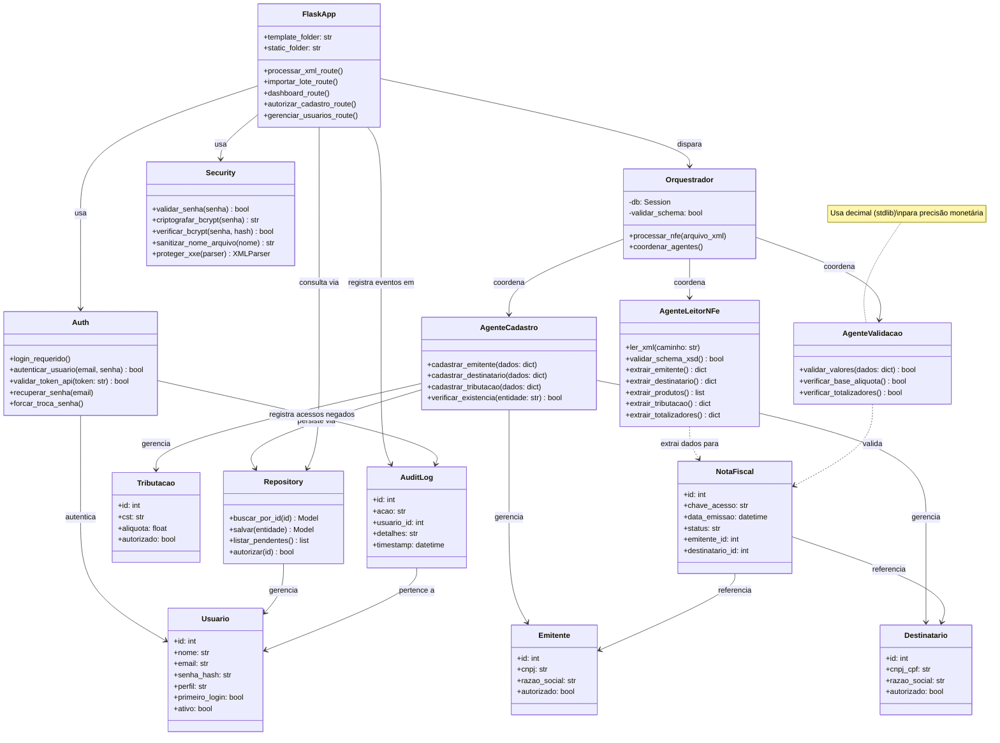
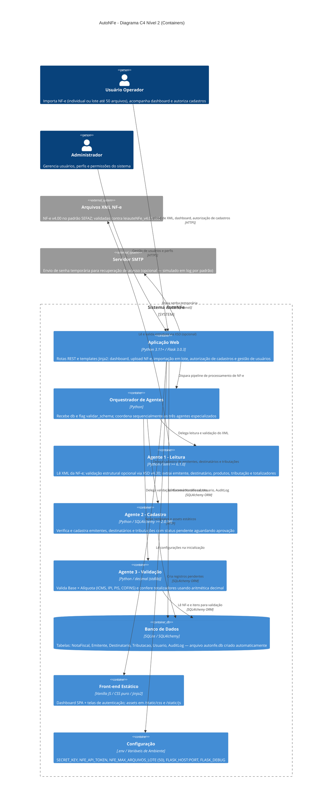

# PRD — AutoNFe

## Diagramas de Arquitetura

---

### Diagrama UML de Classes

Representa as principais classes do sistema, seus atributos, métodos e relacionamentos.
Contexto: `.Kiro/steering/structure.md`, `.Kiro/steering/product.md`, `.Kiro/steering/tech.md`.

---

### Diagrama C4 — Nível 2 (Containers)

Representa os containers do sistema AutoNFe, seus relacionamentos internos e dependências externas.
Contexto: `.Kiro/steering/structure.md`, `.Kiro/steering/product.md`, `.Kiro/steering/tech.md`.

